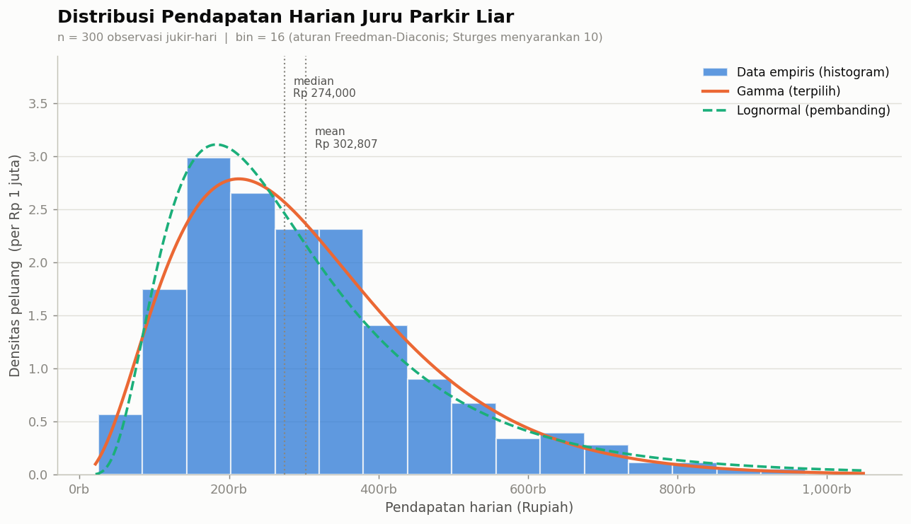
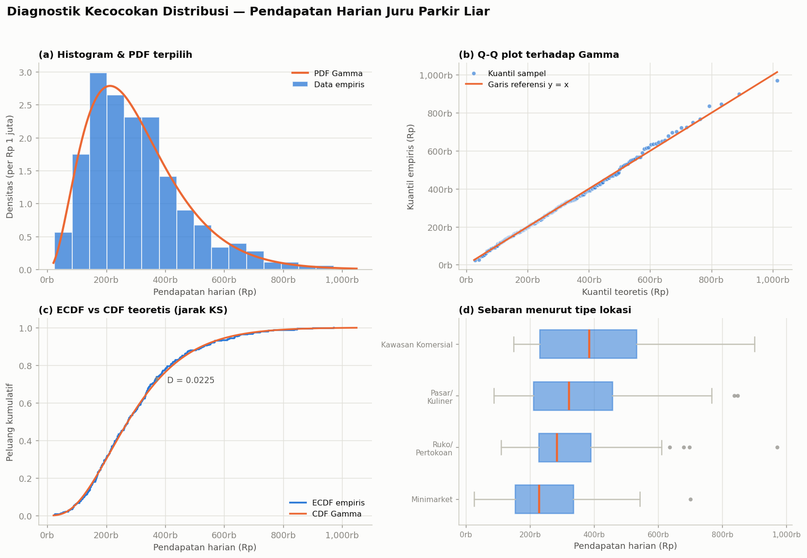
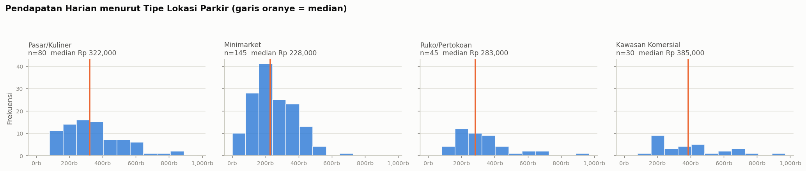

# Permodelan & Simulasi — Distribusi Pendapatan Juru Parkir Liar

Analisis distribusi **pendapatan harian juru parkir liar (jukir liar)** di
Indonesia: pencarian data, identifikasi distribusi, plot histogram, dan prompt
evaluasi untuk menguji validitas data.



---

## Ringkasan hasil

| | |
|---|---|
| **Variabel** | Pendapatan harian per juru parkir (Rupiah) |
| **Ukuran sampel** | 300 observasi jukir-hari (60 jukir × 5 hari) |
| **Distribusi terpilih** | **Gamma** — α (shape) = 3,3714 · β (scale) = 89.817 · loc = 0 |
| **Uji KS** | D = 0,0225 · p (parametric bootstrap) = 0,981 → H₀ **tidak ditolak** |
| **AIC** | 7.999,4 (bobot Akaike 0,73) |
| **Mean / Median** | Rp 302.807 / Rp 274.000 |
| **Kemencengan** | +1,098 (menceng kanan) |

### Peringkat semua kandidat

| Distribusi | AIC | ΔAIC | Bobot Akaike | KS D | KS p (bootstrap) | AD A² |
|---|---:|---:|---:|---:|---:|---:|
| **Gamma** | **7.999,4** | **0,00** | **0,726** | **0,0225** | **0,981** | **0,190** |
| Gumbel | 8.001,4 | 1,97 | 0,271 | 0,0308 | 0,729 | 0,280 |
| Weibull | 8.010,2 | 10,75 | 0,003 | 0,0491 | 0,085 | 1,250 |
| Lognormal | 8.016,8 | 17,37 | 0,000 | 0,0462 | 0,120 | 1,039 |
| Normal | 8.065,2 | 65,75 | 0,000 | 0,0850 | 0,001 | 4,963 |
| Eksponensial | 8.174,5 | 175,09 | 0,000 | 0,2464 | 0,001 | 30,644 |

> **Catatan kejujuran:** ΔAIC Gamma vs Gumbel hanya **1,97** (< 4), sehingga
> keduanya **tidak terbedakan secara meyakinkan**. Kesimpulan yang benar adalah
> *"Gamma paling didukung data"*, bukan *"distribusinya pasti Gamma"*.
> Gamma dipilih sebagai model final karena **selain unggul secara statistik, ia
> juga koheren secara teoretis**: penjumlahan pungutan dari kedatangan Poisson
> dengan intensitas ber-heterogenitas Gamma memang menghasilkan Gamma.

---

## Mengapa Gamma masuk akal secara teori

Pendapatan harian adalah **jumlah pungutan dari kendaraan yang datang**:

```
Pendapatan = Σ (tarif per kendaraan),  banyaknya kendaraan ~ Poisson(λ)
λ berbeda antar-lokasi        →  λ ~ Gamma(k, θ)
Gamma-mixed Poisson           →  Negative Binomial
Compound sum × tarif ~ konstan →  mendekati Gamma
```

Distribusi Gamma bernilai positif, menceng kanan, dan berekor panjang — persis
karakter pendapatan informal: banyak titik sepi, sedikit titik "basah".

---

## Status data — baca ini dulu

Data mikro per-jukir per-hari untuk aktivitas parkir liar **tidak tersedia
sebagai open data**, karena aktivitasnya informal dan tidak tercatat resmi.
Yang tersedia publik hanyalah **angka agregat** dari liputan media, riset
Litbang, dan laporan Dishub.

Karena itu dataset di repo ini dibangun dengan pendekatan **calibrated process
model** (Monte Carlo): proses fisik pungutan parkir disimulasikan, lalu
parameternya dikalibrasi agar statistik ringkasannya cocok dengan angka publik
yang terverifikasi.

**Ini bukan hasil survei lapangan dan bukan data resmi.** Konsekuensi
metodologisnya dibahas terbuka di `docs/PROMPT_EVALUASI.md` Lapis 5.

### Jangkar kalibrasi (sumber publik)

| # | Angka | Sumber |
|---|---|---|
| A1 | Rp 200.000/hari (100 kendaraan × Rp 2.000) | Nailul Huda, CELIOS — [detikFinance](https://finance.detik.com/berita-ekonomi-bisnis/d-7300147/parkir-liar-di-minimarket-merajalela-pendapatan-jukir-bisa-lampaui-umr) |
| A2 | Rp 400.000/hari kotor; Rp 250.000 bersih setelah setoran ±Rp 150.000 | Andy Nugroho — [detikFinance](https://finance.detik.com/berita-ekonomi-bisnis/d-7300147/parkir-liar-di-minimarket-merajalela-pendapatan-jukir-bisa-lampaui-umr) |
| A3 | Rp 17.190.000/bulan omzet 1 titik minimarket → Rp 573.000/hari/titik, Rp 286.500/hari/jukir bila 2 orang | Litbang Kompas — [Tirto](https://tirto.id/mengapa-parkir-dan-jukir-liar-di-jakarta-sulit-diberantas-hBaU) |
| A4 | Tarif rujukan: motor Rp 2.000, mobil Rp 5.000 | Pergub DKI 31/2017 — [Tirto](https://tirto.id/mengapa-parkir-dan-jukir-liar-di-jakarta-sulit-diberantas-hBaU) |
| A5 | Pungutan menyimpang: Rp 10.000 (Bundaran HI), Rp 30.000 (Bandung), Rp 60.000–100.000 (Tanah Abang) | [Tirto](https://tirto.id/mengapa-parkir-dan-jukir-liar-di-jakarta-sulit-diberantas-hBaU), [Jabar Ekspres](https://jabarekspres.com/berita/2025/10/07/jukir-liar-di-bandung-kenakan-tarif-rp30-ribu-dishub-dan-polisi-langsung-bertindak/) |

### Seberapa dekat data dengan jangkarnya

| Statistik | Data | Jangkar | Selisih |
|---|---:|---:|---:|
| Mean | Rp 302.807 | Rp 286.500 (A3) | 5,7 % |
| Median | Rp 274.000 | Rp 250.000 (A2) | 9,6 % |
| Persentil 90 | Rp 529.300 | Rp 573.000 (A3) | 7,6 % |

---

## Isi repositori

```
.
├── data/
│   └── pendapatan_jukir_liar.csv      dataset 300 baris
├── src/
│   ├── 01_generate_dataset.py         bangun dataset (seed tetap = 42)
│   ├── 02_uji_distribusi.py           fit 6 distribusi + KS/AD/AIC
│   ├── 03_plot_histogram.py           histogram + Q-Q + ECDF + boxplot
│   └── 04_validasi_mandiri.py         16 pemeriksaan validitas otomatis
├── output/
│   ├── histogram_pendapatan.png       histogram utama
│   ├── diagnostik_distribusi.png      panel diagnostik 2×2
│   ├── histogram_per_lokasi.png       small multiples per tipe lokasi
│   ├── hasil_uji_distribusi.csv       tabel peringkat lengkap
│   └── ringkasan.json                 ringkasan mesin-terbaca
└── docs/
    └── PROMPT_EVALUASI.md             prompt evaluasi validitas data
```

---

## Cara menjalankan

```bash
pip install -r requirements.txt

python src/01_generate_dataset.py     # -> data/pendapatan_jukir_liar.csv
python src/02_uji_distribusi.py       # -> output/hasil_uji_distribusi.csv
python src/03_plot_histogram.py       # -> output/*.png
python src/04_validasi_mandiri.py     # -> laporan validasi ke terminal
```

Seluruh skrip memakai `seed = 42`, sehingga hasilnya **identik setiap kali
dijalankan**.

---

## Diagnostik kecocokan



- **(a)** histogram + PDF Gamma — bin ditentukan aturan Freedman–Diaconis (16 bin), lebih tahan outlier daripada Sturges (10 bin)
- **(b)** Q-Q plot — titik hampir seluruhnya menempel garis y = x
- **(c)** ECDF vs CDF teoretis — jarak KS maksimum ditandai (D = 0,0225)
- **(d)** boxplot per tipe lokasi — median naik dari Minimarket ke Kawasan Komersial



---

## Hasil validasi mandiri

`src/04_validasi_mandiri.py` menjalankan 16 pemeriksaan. Hasil terakhir:

**13 LULUS · 3 PERINGATAN · 0 GAGAL → VALID DENGAN SYARAT**

Tiga peringatan yang harus disebut dalam laporan:

1. **ICC = 0,249** — 24,9 % ragam berasal dari perbedaan antar-jukir. Karena
   tiap jukir diamati 5 hari, observasi **tidak independen**; ukuran sampel
   efektif hanya ±150, bukan 300.
2. **ΔAIC = 1,97** — Gamma dan Gumbel tidak terbedakan secara meyakinkan.
3. **Tidak kokoh terhadap pemangkasan** — setelah 5 % nilai tertinggi dibuang,
   pemenang bergeser ke Weibull. Artinya keunggulan Gamma sebagian ditopang
   perilaku ekor kanan.

---

## Prompt evaluasi validitas data

Prompt lengkap ada di **[`docs/PROMPT_EVALUASI.md`](docs/PROMPT_EVALUASI.md)**.

Prompt disusun **adversarial** — evaluator diminta mencari alasan untuk
*menolak* data, bukan mengonfirmasinya, karena prompt bergaya "tolong cek apakah
data ini valid" hampir selalu dijawab "valid". Lima lapis pemeriksaan:

| Lapis | Yang diuji | Contoh butir yang bisa GAGAL |
|---|---|---|
| 1. Integritas struktural | dimensi, NA, duplikat, tipe data | ada pendapatan negatif |
| 2. Koherensi internal | tarif implisit, kelipatan Rp 1.000, korelasi, ICC | tarif implisit < Rp 2.000 = mustahil |
| 3. Kewajaran vs dunia nyata | selisih terhadap 4 jangkar publik, batas fisik | kendaraan/jam melampaui kapasitas 1 orang |
| 4. Verifikasi klaim distribusi | fit ulang, ΔAIC, bootstrap KS, uji pangkas 5 % | pemenang berubah setelah outlier dibuang |
| 5. Kejujuran epistemik | sifat tautologis data sintetis, protokol lapangan, risiko kebijakan | tidak dapat diotomatiskan |

Lapis 1, 2, dan 4 sudah diotomatiskan di `src/04_validasi_mandiri.py`.
Lapis 3 dan 5 perlu dijalankan pada LLM dengan prompt tersebut.

---

## Batasan yang diakui

- Dataset **sintetis terkalibrasi**, bukan pengukuran lapangan. Menemukan bahwa
  data cocok dengan Gamma sebagian bersifat **tautologis** — struktur
  Gamma-Poisson sudah tertanam dalam cara data dibangkitkan.
- Model **tidak menangkap**: setoran ke oknum/preman, musim hujan, razia Dishub,
  hari libur nasional, shift malam, lokasi wisata musiman.
- Angka jangkar berasal dari **Jakarta dan sekitarnya**; generalisasi ke kota
  lain belum diuji.
- Dataset ini **sah** dipakai untuk latihan permodelan, uji distribusi, dan
  simulasi antrian; **tidak boleh** dipakai sebagai bukti empiris untuk
  rekomendasi kebijakan penertiban.

---

## Lisensi

MIT — bebas dipakai untuk keperluan akademik.
